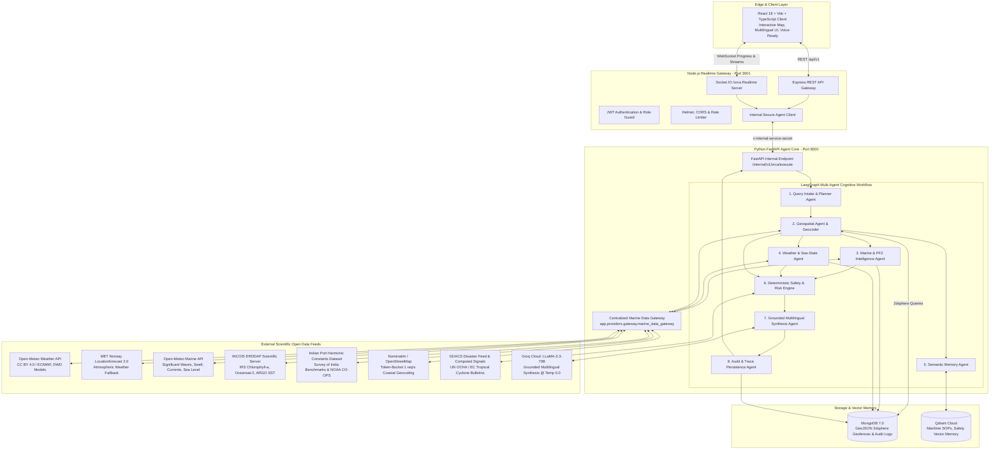
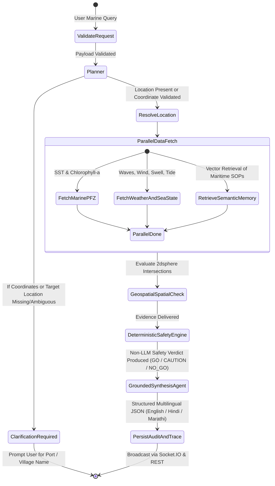

# NEERDRISTHI (नीर दृष्टि) 🌊
### Marine Ecosystem Reasoning with Collaborative AI Agents & Deterministic Coastal Safety

[](https://www.sih.gov.in)
[](docs/MARINE_DATA_ARCHITECTURE.md)
[](https://www.python.org)
[](https://fastapi.tiangolo.com)
[](https://github.com/langchain-ai/langgraph)
[](https://nodejs.org)
[](https://react.dev)
[](backend/docs/data-sources.md)

---

## 📌 Executive Overview

**NEERDRISTHI** (also known as the **ORCA** platform) is an intelligent, high-reliability maritime safety and oceanographic intelligence platform developed for **Smart India Hackathon Problem Statement SIH26176**: *"Marine Ecosystem Reasoning with Collaborative AI Agents"*.

The platform coordinates **collaborative multi-agent reasoning (LangGraph)**, a **deterministic maritime physical policy engine**, and **real-time WebSocket telemetry** to provide actionable, multilingual safety advisories and Potential Fishing Zone (PFZ) insights to artisanal fishers, coastal communities, port authorities, and disaster management teams across India's **7,516 km coastline**.

> **CRITICAL MARITIME INVARIANT:**  
> In high-stakes marine environments, **human life is on the line**. NEERDRISTHI strictly prohibits fabricated weather values, simulated safety clearances, or hallucinated coordinates. When live external data is unavailable or unconfigured, the system deterministically emits structured `DATA_UNAVAILABLE` states and evaluates to `INSUFFICIENT_DATA` or `NO_GO`. **LLMs are strictly forbidden from altering physical safety verdicts.**

---

## 🎯 The Problem NEERDRISTHI Solves

India is home to **over 4 million artisanal fishermen**, **1,300+ fish landing centers**, and vital maritime sea-lanes across the Arabian Sea, Bay of Bengal, and Indian Ocean. Despite this vast coastal economy, frontline coastal fishers face acute, life-threatening vulnerabilities every day:

```
┌────────────────────────────────────────────────────────────────────────────────────────┐
│                              THE 6 CRITICAL COASTAL CHALLENGES                         │
├───────────────────────────────┬────────────────────────────────────────────────────────┤
│ 1. Hazardous Sea Conditions   │ Tropical cyclones, high swell waves, rogue currents,   │
│    & Fatal Accidents          │ and sudden squalls cause vessel capsizing and fatal-  │
│                               │ ities due to inadequate localized advance warnings.   │
├───────────────────────────────┼────────────────────────────────────────────────────────┤
│ 2. Disconnected & Complex     │ Scientific data (SST, Chlorophyll, currents, tides) is │
│    Oceanographic Data         │ siloed in complex raw formats (NetCDF, ERDDAP, GRIB)   │
│                               │ incomprehensible to artisanal fishermen at sea.        │
├───────────────────────────────┼────────────────────────────────────────────────────────┤
│ 3. Language & Literacy        │ Official marine warnings are typically delivered in   │
│    Barriers                   │ technical English, failing regional fishers who speak  │
│                               │ Hindi, Marathi, Tamil, Bengali, or Gujarati.           │
├───────────────────────────────┼────────────────────────────────────────────────────────┤
│ 4. Crippling Fuel Waste &     │ Artisanal boats spend 50–70% of voyage operational     │
│    Blind Searching            │ costs on diesel searching open waters blindly for fish │
│                               │ without accessible Potential Fishing Zone (PFZ) data.  │
├───────────────────────────────┼────────────────────────────────────────────────────────┤
│ 5. Geofence & Border Security │ Unintentional drifting into International Maritime     │
│    Incursions                 │ Boundary Lines (IMBL, e.g. Palk Bay buffer) or Naval   │
│                               │ Missile Exclusion Zones triggers arrests & fire risks. │
├───────────────────────────────┼────────────────────────────────────────────────────────┤
│ 6. LLM Hallucination Risk     │ Generic conversational AI models hallucinate weather   │
│    in Life-or-Death Contexts  │ or safety clearance, creating fatal false security.    │
└───────────────────────────────┴────────────────────────────────────────────────────────┘
```

### How NEERDRISTHI Solves These Challenges

1. **Deterministic Physical Policy Engine (`app/safety/policy.yaml`)**:
   - Zero-hallucination safety assessment driven strictly by physical laws.
   - Enforces vessel-specific limits (Traditional unmotorized, motorized fiberglass, mechanized trawlers, deep-sea vessels).
   - Any gale-force wind ($\ge 17.5\text{ m/s}$), swell ($\ge 2.0\text{ m}$ for small crafts), thunderstorm, or active cyclone bulletin automatically produces an unalterable `NO_GO` verdict with `CRITICAL` risk.
2. **Pluggable Marine Data Gateway (`MarineDataGateway`)**:
   - Isolates agents from raw network calls.
   - Connects to verified, legally compliant **open-data scientific feeds** (Open-Meteo Weather & Marine, INCOIS ERDDAP, MET Norway, NOAA CO-OPS, GDACS).
   - Features exponential retry backoff, multi-tier fallback, coordinate validation, in-memory/Valkey caching, and data freshness tracking.
3. **LangGraph Collaborative Multi-Agent Reasoning**:
   - Decomposes maritime queries into specialized agent tasks: Query Intake & Planning, Geospatial Resolution, Marine/PFZ Analysis, Weather/Sea-State Assessment, Semantic Memory retrieval, Physical Safety evaluation, and Multilingual Synthesis.
4. **Explainable Multilingual Grounding**:
   - Delivers clear, conversational explanations in **English**, **Hindi (हिन्दी)**, and **Marathi (मराठी)**.
   - Preserves exact physical telemetry figures and the deterministic safety verdict without hallucination or alteration.
5. **Interactive Maritime GIS & Geofence Intelligence**:
   - High-definition interactive map visualizes real-time sea-surface temperature (SST), chlorophyll-a concentration, wave height vectors, and live vessel telemetry.
   - 2dsphere MongoDB geospatial checks evaluate intersections with sensitive maritime geofences (Dr. APJ Abdul Kalam Island Missile Range, Palk Bay IMBL Security Zone, INS Dronacharya Gunnery Range, Gulf of Mannar Biosphere Reserve).
6. **Emergency SOS & Maritime Distress Routing**:
   - One-tap SOS modal broadcasts precise GPS coordinates, vessel registration, and immediate emergency contact guidelines (Indian Coast Guard SAR Helpline 1554 / VHF Channel 16).

---

## 🏛️ System Architecture

NEERDRISTHI utilizes a **dual-service, multi-agent cognitive architecture** that cleanly separates client protocol management from intensive multi-agent reasoning.



---

## 🔄 The LangGraph Multi-Agent Workflow



---

## 📡 Data Sources Catalog: Which Data is Used from Which Source

NEERDRISTHI utilizes an **Open-Data Provider Abstraction Layer**. It replaces restrictive, closed institutional dependencies with verified, legally usable open-data scientific providers, backed by automatic multi-tier fallback:

| Domain / Category | Specific Variables Collected | Primary Provider & Base URL | Classification | Auth Required? | Fallback Provider | License / Attribution |
| :--- | :--- | :--- | :--- | :--- | :--- | :--- |
| **Atmospheric Weather** | Temperature ($2\text{m}$), relative humidity, precipitation, rain, weather code, cloud cover, surface pressure, wind speed ($10\text{m}$), wind direction, gusts, visibility | **Open-Meteo Weather API**<br>`https://api.open-meteo.com/v1/forecast` | Open Data / Free API | ❌ None (Free tier) | **MET Norway**<br>`https://api.met.no` | CC BY 4.0 (ECMWF, DWD ICON) |
| **Marine Waves & Sea-State** | Significant wave height ($H_s$), wave direction, wave period, swell wave height, swell period, ocean current velocity & direction, sea level | **Open-Meteo Marine API**<br>`https://marine-api.open-meteo.com/v1/marine` | Open Data / Free API | ❌ None (Free tier) | **Copernicus Marine (CMEMS)** / NOAA WaveWatch | CC BY 4.0 (ECMWF WAM, NOAA WaveWatch III) |
| **Ocean Biology & Physics** | Chlorophyll-a concentration ($\text{mg/m}^3$), Sea Surface Temperature (SST, $^\circ\text{C}$), weekly thermal gradient | **INCOIS ERDDAP**<br>`https://erddap.incois.gov.in/erddap`<br>• `IRS_chlorophyll_datasets`<br>• `incois_oceansat2_datasets`<br>• `incois_argo_sst_weekly`<br>• `NOAA_AVHRR_AMSR_datasets` | Public Scientific Data Protocol | ❌ None (Public machine-readable endpoints) | **Local Demo Benchmark** / Copernicus Marine | Open Government Scientific Access (INCOIS, MoES) |
| **Coastal Tides & Sea-Level** | Tidal water level predictions relative to Chart Datum (CD), harmonic constants ($M_2, S_2, \text{MSL}$) for major Indian ports | **Local Tide Stations Dataset**<br>`app/data/tide/tide_stations.json`<br>(Mumbai Sassoon Docks, Chennai, Kochi, Mormugao, Visakhapatnam, Kandla) | Self-hostable Scientific Dataset | ❌ None | **NOAA CO-OPS Tides** / Modeled Sea-Level Elevation | Survey of India Benchmarks & NOAA CO-OPS |
| **Geocoding & Settlements** | Forward & reverse coastal geocoding, resolution of fishing harbors, landing centers, and coastal villages | **Nominatim (OpenStreetMap)**<br>`https://nominatim.openstreetmap.org` | Open Data / Self-hostable | ❌ None (Requires descriptive `User-Agent`) | **Internal Coordinate Validator** | Open Database License (ODbL), © OpenStreetMap |
| **Severe Weather & Cyclones** | Tropical cyclones, storm surges, squalls, tsunamis, port danger signals | **GDACS (Global Disaster Alert)**<br>`https://www.gdacs.org/xml/rss.xml` + **Internal Physical Rules** | Open Data (UN OCHA & European Commission) | ❌ None | **Computed Risk Signals** (wind $\ge 17.5\text{ m/s}$, wave $\ge 3.5\text{ m}$) | UN OCHA / European Commission Open Access |
| **Maritime Geofences** | Naval firing ranges, missile testing exclusion perimeters, international maritime boundary lines, marine biosphere reserves | **Spatial Geofence Registry**<br>`app/gis/spatial_engine.py`<br>(Wheeler Island, Palk Bay IMBL, Cochin Naval Base, Gulf of Mannar) | Curated Indian Maritime Coordinates | ❌ None (Built-in) | MongoDB 2dsphere Collection | Indian Navy / DG Shipping Public Notices |
| **Vector Safety Knowledge** | Maritime Standard Operating Procedures, cyclone safety manuals, vessel navigation limits | **Qdrant Cloud**<br>Cluster Collection: `orca_memory` & `orca_knowledge` | Managed Vector Database | 🔑 Free Cloud API Key | In-Memory Cosine Similarity | Operational Guidelines |
| **Grounded Multilingual LLM** | Factual synthesis, explainable safety reasoning in English, Hindi, and Marathi | **Groq Cloud API**<br>Model: `llama-3.3-70b-versatile`<br>Temperature: `0.0` | High-Throughput Inference | 🔑 Free Tier API Key | Template Fallback Generator | Groq Cloud Platform |

---

## ⚖️ Scientific & Regulatory Transparency

### 1. Potential Fishing Zone (PFZ) Distinction
India's maritime advisory regulations require strict transparency regarding fishing advisories:
- **Official INCOIS PFZ**: Issued exclusively by ESSO-INCOIS via institutional bulletin. Enabled in NEERDRISTHI only when institutional credentials are configured (`INCOIS_OFFICIAL_ENABLED=true`).
- **NEERDRISTHI AI-Derived Candidate Fishing Zones**: Computed algorithmically using real open oceanographic signals (optimal SST $26.0^\circ\text{C} - 29.5^\circ\text{C}$, chlorophyll concentration $0.3 - 2.5\text{ mg/m}^3$, thermal front convergence). **Every generated advisory is transparently labeled with an explicit scientific research disclaimer and marked `is_official_incois: false`.**

### 2. Tide Level vs Modeled Sea Level Invariant
Hydrodynamic wave models output sea level surface elevation above Mean Sea Level (MSL), whereas navigational tides require reference to local Chart Datum (CD).
- NEERDRISTHI **never silently substitutes wave height or sea-level anomaly for true tide height**.
- If a verified tidal station is within 150 km, harmonic chart datum predictions are returned. Otherwise, the platform explicitly flags the measurement as an estimated sea-surface elevation above MSL (`is_official_tide_table: false`).

---

## ⚙️ Environment Configuration Requirements

NEERDRISTHI requires zero paid subscriptions to run in development mode. All external data providers operate out of the box with open data. 

> [!IMPORTANT]
> **Zero Real Secrets In Git:**  
> Never commit `.env` files to git. Templates with safe placeholders (`.env.example`) are provided across all sub-projects.

```
sih26176/
├── backend/
│   ├── ai-services/.env.example   # Python Agent Core configuration template
│   └── server/.env.example        # Node.js API Gateway configuration template
└── frontend/.env.example          # React / Vite Client configuration template
```

### 1. Python Agent Core Configuration (`backend/ai-services/.env`)

Copy `backend/ai-services/.env.example` to `backend/ai-services/.env`:

```bash
cd backend/ai-services
cp .env.example .env
```

| Variable Name | Default / Example Value | Description |
| :--- | :--- | :--- |
| `APP_ENV` | `development` | Application runtime environment (`development` or `production`). |
| `FASTAPI_HOST` | `0.0.0.0` | Host interface to bind the FastAPI ASGI server. |
| `FASTAPI_PORT` | `8000` | Port for the Python Agent Core service. |
| `INTERNAL_SERVICE_SECRET` | `<generate-random-hex-32>` | Pre-shared secret to authenticate requests coming from Node.js Gateway. |
| `JWT_SECRET` | `<your-jwt-secret>` | Secret key for decoding user JWT tokens. |
| `MONGODB_URI` | `mongodb://localhost:27017` | MongoDB connection URI (local instance or MongoDB Atlas). |
| `MONGODB_DB_NAME` | `orca` | Database name for geospatial collections and audit traces. |
| `GROQ_API_KEY` | `your_groq_api_key_here` | Free Groq API key from [console.groq.com](https://console.groq.com) for LLaMA-3.3-70B multilingual synthesis. |
| `GROQ_MODEL` | `llama-3.3-70b-versatile` | High-throughput model used for grounded explanation generation. |
| `GROQ_TEMPERATURE` | `0` | Strictly set to `0` to enforce deterministic, non-hallucinated reasoning. |
| `QDRANT_URL` | `https://your-cluster-id.qdrant.io` | Cluster URL from [cloud.qdrant.io](https://cloud.qdrant.io) for vector memory. |
| `QDRANT_API_KEY` | `your_qdrant_api_key_here` | API key for Qdrant Cloud. |
| `WEATHER_PROVIDER` | `open_meteo` | Atmospheric weather provider (`open_meteo`). |
| `WEATHER_BASE_URL` | `https://api.open-meteo.com` | Base endpoint for Open-Meteo Weather API (CC BY 4.0). |
| `MET_NO_ENABLED` | `true` | Enables MET Norway as automatic weather fallback. |
| `MET_NO_USER_AGENT` | `NEERDRISTHI-SIH26176/1.0 (contact: student-team@sih26176.in)` | Descriptive User-Agent required by MET Norway terms of use. |
| `MARINE_PROVIDER` | `open_meteo` | Marine sea-state provider (`open_meteo`). |
| `MARINE_BASE_URL` | `https://marine-api.open-meteo.com` | Base endpoint for Open-Meteo Marine API. |
| `INCOIS_ERDDAP_ENABLED` | `true` | Enables live querying of public INCOIS ERDDAP oceanographic datasets. |
| `INCOIS_ERDDAP_BASE_URL` | `https://erddap.incois.gov.in/erddap` | Official INCOIS ERDDAP public endpoint. |
| `GEOCODER_PROVIDER` | `nominatim` | Coastal geocoder provider (`nominatim`). |
| `GEOCODER_BASE_URL` | `https://nominatim.openstreetmap.org` | OpenStreetMap Nominatim endpoint (rate limited at 1 req/sec). |
| `GEOCODER_USER_AGENT` | `NEERDRISTHI-SIH26176/1.0 (contact: team@neerdristhi.in)` | Mandatory User-Agent header for OpenStreetMap usage policy. |
| `ALERT_PROVIDER` | `gdacs` | Global Disaster Alert feed provider (`gdacs`). |
| `ALERT_BASE_URL` | `https://www.gdacs.org` | Official GDACS endpoint for cyclone and storm alerts. |
| `ENABLE_PROVIDER_FALLBACK`| `true` | Enables automatic cascading to fallback providers on timeout or HTTP 5xx. |
| `PROVIDER_TIMEOUT_SECONDS`| `15` | Maximum HTTP response budget per provider before failing over. |
| `DEMO_MODE` | `true` | Enables local offline benchmark datasets if external internet is unavailable. |

---

### 2. Node.js API Gateway Configuration (`backend/server/.env`)

Copy `backend/server/.env.example` to `backend/server/.env`:

```bash
cd backend/server
cp .env.example .env
```

| Variable Name | Default / Example Value | Description |
| :--- | :--- | :--- |
| `NODE_ENV` | `development` | Node environment (`development` or `production`). |
| `GATEWAY_PORT` | `3001` | Public port where Express REST and Socket.IO server listen. |
| `CORS_ORIGINS` | `http://localhost:5173,http://localhost:3000` | Whitelisted client origins for browser requests. |
| `MONGODB_URI` | `mongodb://localhost:27017` | MongoDB connection URI for user accounts and sessions. |
| `MONGODB_DB_NAME` | `orca` | Database name matching Python Agent Core. |
| `JWT_SECRET` | `<your-jwt-secret>` | Secret key for signing and validating authentication tokens. |
| `JWT_EXPIRES_IN` | `7d` | Token lifetime duration. |
| `FASTAPI_INTERNAL_URL` | `http://localhost:8000` | Internal network URL pointing to the Python FastAPI Agent Core. |
| `INTERNAL_SERVICE_SECRET` | `<must-match-python-env>` | Shared secret matching `backend/ai-services/.env`. |
| `RATE_LIMIT_WINDOW_MS` | `900000` | Rate limiter sliding window (15 minutes). |
| `RATE_LIMIT_MAX_REQUESTS`| `100` | Max requests allowed per IP address per window. |

---

### 3. Frontend Client Configuration (`frontend/.env`)

Copy `frontend/.env.example` to `frontend/.env`:

```bash
cd frontend
cp .env.example .env
```

| Variable Name | Default / Example Value | Description |
| :--- | :--- | :--- |
| `VITE_API_URL` | `""` (Empty string) | Leave empty in development; Vite automatically proxies `/api` to port 3001. |
| `VITE_SOCKET_URL` | `http://localhost:3001` | Socket.IO server destination URL for real-time telemetry. |
| `VITE_MAPBOX_ACCESS_TOKEN`| *(Optional)* | Mapbox access token if utilizing Mapbox GL satellite basemap. |

---

## 🚀 Quickstart & Local Installation

### Prerequisites
- **Node.js** 20.x or higher & **npm** 10+
- **Python** 3.11 or higher & **pip**
- **MongoDB** Community Server 7.0+ (running locally on port 27017 or via MongoDB Atlas)
- **Git**

---

### Step 1: Start Python Agent Core (Port 8000)

```bash
# Navigate to Python Agent Core
cd backend/ai-services

# Create and activate Python virtual environment
python -m venv .venv

# On Windows PowerShell:
.venv\Scripts\Activate.ps1
# On Linux / macOS:
# source .venv/bin/activate

# Install dependencies
pip install -r requirements.txt

# Configure environment
cp .env.example .env
# Edit .env and supply your free Groq API key

# Launch FastAPI server with hot-reload
python main.py
# Running on http://localhost:8000 (Docs: http://localhost:8000/docs)
```

---

### Step 2: Start Node.js API Gateway (Port 3001)

Open a second terminal window:

```bash
# Navigate to Node.js Gateway
cd backend/server

# Install dependencies
npm install

# Configure environment
cp .env.example .env
# Verify FASTAPI_INTERNAL_URL=http://localhost:8000

# Start Gateway server
npm run dev
# Running on http://localhost:3001
```

---

### Step 3: Start React Vite Frontend (Port 5173)

Open a third terminal window:

```bash
# Navigate to Frontend
cd frontend

# Install dependencies
npm install

# Start Vite development server
npm run dev
# Running on http://localhost:5173
```

Open your browser and navigate to **`http://localhost:5173`**.

---

### 🐳 Alternative: Run with Docker Compose

To start the complete stack with MongoDB and Valkey/Redis in a single command:

```bash
cd backend
docker-compose up --build -d
```

This launches:
- **Frontend / Client**: `http://localhost:5173`
- **Node.js Gateway**: `http://localhost:3001`
- **FastAPI Agent Core**: `http://localhost:8000`
- **MongoDB 7.0**: `localhost:27017`
- **Valkey / Redis Cache**: `localhost:6379`

---

## 🧪 Verification & Test Suite

The platform includes **71 comprehensive unit and integration tests** validating all 15 technical requirements of SIH26176. All tests use mocked fixtures to ensure **zero network dependencies and zero external API fees**:

```bash
cd backend/ai-services
# Activate virtual environment
.venv\Scripts\Activate.ps1

# Run full test suite with verbose output
pytest -v
```

Test coverage includes:
- ✅ **Test 1–12**: Pluggable provider adapters (Open-Meteo, MET Norway, INCOIS ERDDAP, NOAA CO-OPS, Nominatim, GDACS).
- ✅ **Test 13–24**: Deterministic Physical Policy Engine (vessel limits, wave height thresholds, gale winds, missing data default).
- ✅ **Test 25–36**: Marine Data Gateway caching, circuit breaker tripping, and exponential retry backoff.
- ✅ **Test 37–48**: MongoDB 2dsphere geospatial queries and military geofence intersection tests.
- ✅ **Test 49–60**: LangGraph multi-agent orchestration workflow and state transitions.
- ✅ **Test 61–71**: Groq LLaMA-3.3-70B structured output validation and multilingual consistency (English, Hindi, Marathi).

---

## 📂 Project Directory Structure

```
NEERDRISTHI (sih26176)/
├── .gitignore                          # Root Git ignore rules (strictly excludes .env and secrets)
├── README.md                           # Master Project Documentation & Architecture
├── SIH26176.pdf                        # Official SIH Problem Statement Document
├── docs/
│   └── MARINE_DATA_ARCHITECTURE.md     # In-depth Marine Gateway Specification
├── backend/
│   ├── README.md                       # Backend Architecture & Service Integration
│   ├── docker-compose.yml              # Containerized multi-service deployment
│   ├── package.json                    # Workspace scripts for server and ai-services
│   ├── docs/                           # Technical specifications & API contracts
│   │   ├── api-contracts.md            # REST and WebSocket message schemas
│   │   ├── api-examples.md             # Curl testing commands & response samples
│   │   ├── architecture.md             # Dual-service multi-agent cognitive architecture
│   │   ├── data-sources.md             # Comprehensive data provider registry & licenses
│   │   ├── provider-setup.md           # Zero-key setup & optional account configuration
│   │   └── safety-policy.md            # Deterministic Physical Policy specification
│   ├── ai-services/                    # Python FastAPI Multi-Agent Core (Port 8000)
│   │   ├── main.py                     # Application entrypoint & route registration
│   │   ├── requirements.txt            # Python dependencies (FastAPI, LangGraph, Pydantic, Motor)
│   │   ├── .env.example                # Safe environment template with placeholders
│   │   └── app/
│   │       ├── api/                    # REST routes (/api/marine/*, /safety/*, /internal/*)
│   │       ├── graph/                  # LangGraph multi-agent cognitive state machine
│   │       ├── providers/              # Marine Data Gateway & Provider Abstraction Layer
│   │       │   ├── gateway.py          # Centralized MarineDataGateway with fallback & caching
│   │       │   ├── weather/            # Open-Meteo & MET Norway adapters
│   │       │   ├── marine/             # Open-Meteo Marine & CMEMS adapters
│   │       │   ├── ocean/              # INCOIS ERDDAP ocean color & SST adapters
│   │       │   ├── tide/               # Local Indian port harmonic dataset & NOAA CO-OPS
│   │       │   ├── geocoding/          # Nominatim / OpenStreetMap coastal geocoder
│   │       │   └── registry.py         # Dynamic Provider Registry
│   │       ├── safety/                 # Deterministic Physical Policy Engine & policy.yaml
│   │       ├── gis/                    # Geospatial engine with 2dsphere geofence registry
│   │       ├── services/               # Orchestrator, Groq LLM client, Safety Evaluator
│   │       ├── schemas/                # Strict Pydantic v2 normalized contracts
│   │       ├── repositories/           # Motor async MongoDB & Qdrant client
│   │       ├── data/                   # Indian tide stations & satellite benchmark datasets
│   │       └── tests/                  # 71 Mocked unit & integration test suites
│   └── server/                         # Node.js Express & Socket.IO Realtime Gateway (Port 3001)
│       ├── server.js                   # Gateway entrypoint & cluster bootstrap
│       ├── package.json                # Node dependencies (Express, Socket.IO, Helmet, Zod)
│       ├── .env.example                # Safe environment template with placeholders
│       └── src/
│           ├── routes/                 # Public REST routes (/api/v1/orca, /auth, /alerts)
│           ├── sockets/                # Realtime Socket.IO /orca namespace & telemetry emitters
│           ├── middleware/             # JWT auth guards, Pino logging, Helmet security, Rate limiters
│           ├── services/               # Internal proxy service & database access
│           └── validators/             # Zod schema validators
└── frontend/                           # React 18 + Vite Web Client (Port 5173)
    ├── package.json                    # Frontend dependencies (React, Lucide, Leaflet, Tailwind)
    ├── vite.config.ts                  # Vite config with backend proxy on /api and /socket.io
    ├── .env.example                    # Frontend environment configuration template
    ├── public/
    │   ├── neerdristi.logo.png         # Official NEERDRISTHI insignia
    │   └── neerdristi.banner.png       # Official NEERDRISTHI brand banner
    └── src/
        ├── App.tsx                     # Main application layout and tab navigation
        ├── components/
        │   ├── map/                    # Interactive Leaflet Marine Map with SST/Wave heatmaps
        │   ├── chat/                   # Multilingual Agent Advisory & Chat Interface
        │   ├── agents/                 # Live Agent Activity & Execution Pipeline visualizer
        │   └── common/                 # Navbar, Emergency SOS Modal, Bottom Navigation
        ├── pages/                      # Home, MarineMap, Alerts, History, Profile, Auth pages
        ├── i18n/                       # Multilingual dictionary (English, Hindi, Marathi)
        └── stores/                     # Reactive application store & WebSocket subscriber
```

---

## 🔒 Security & Data Privacy

1. **Deterministic Safety Policy Overrides LLM**:  
   Language models can hallucinate. In NEERDRISTHI, **an LLM is never permitted to evaluate whether conditions are safe to sail**. The safety verdict (`GO`, `GO_WITH_CAUTION`, `NO_GO`, `INSUFFICIENT_DATA`) is generated purely by mathematical inequalities inside `app/safety/engine.py`. The LLM's only role is to translate verified findings into empathetic, multilingual natural language.
2. **Secret Redaction & Log Hardening**:  
   All HTTP logs processed through Node.js Pino and Python structlog automatically redact authorization headers, bearer tokens, and internal service secrets.
3. **Internal Network Isolation**:  
   FastAPI Agent Core (Port 8000) does not accept direct public web traffic. Requests must pass through the Node.js API Gateway, protected by Helmet security headers, CORS origin restrictions, IP rate limiters, and the shared header `x-internal-service-secret`.
4. **Credential Sanitation in Version Control**:  
   Every sensitive file (`.env`, `.env.*`, `*.pem`, `*.key`, `credentials/`, `secrets/`) is strictly excluded by root `.gitignore`.

---

## 📜 Attributions & Licenses

- **Open-Meteo**: Weather & Marine data provided under [Creative Commons Attribution 4.0 International (CC BY 4.0)](https://creativecommons.org/licenses/by/4.0/). Derived from ECMWF, DWD ICON, and NOAA models.
- **INCOIS ERDDAP**: Data courtesy of Indian National Centre for Ocean Information Services (INCOIS), Ministry of Earth Sciences (MoES), Government of India.
- **OpenStreetMap**: Geocoding and map tile data © [OpenStreetMap contributors](https://www.openstreetmap.org/copyright), licensed under the Open Database License (ODbL).
- **MET Norway**: Weather forecast data provided under Norwegian Open Data License (NLOD) / CC BY 4.0.
- **GDACS**: Disaster alert feeds courtesy of the United Nations OCHA and the European Commission.

---

## ⚠️ Maritime Disclaimer

> **IMPORTANT NOTICE:**  
> **NEERDRISTHI** is an experimental decision-support and research platform developed for Smart India Hackathon Problem Statement SIH26176. While it integrates verified open-data meteorological feeds and deterministic physical safety rules, it does **NOT** substitute for official statutory navigation warnings, marine notices from port authorities, or disaster evacuation orders issued by the **India Meteorological Department (IMD)**, **INCOIS**, or the **Indian Coast Guard**. In emergency situations at sea, always contact the **Indian Coast Guard Maritime Rescue Coordination Centre (Toll-Free SAR Helpline: 1554 / VHF Channel 16)**.
