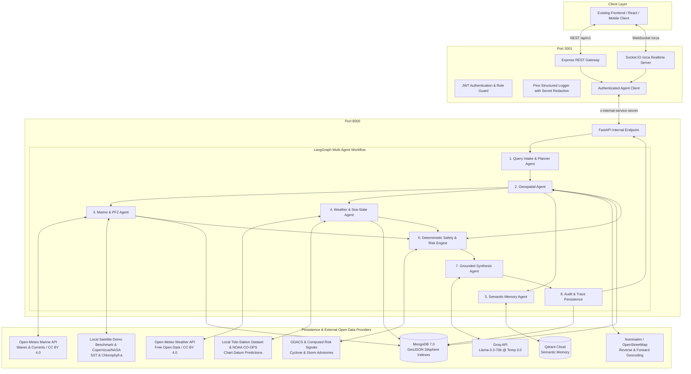

# ORCA: Marine Ecosystem Reasoning with Collaborative Agents

[](https://www.sih.gov.in)
[](#architecture)
[](https://nodejs.org)
[](https://www.python.org)
[](#license)

ORCA is a high-reliability, production-grade maritime intelligence and safety platform developed for **Smart India Hackathon Problem Statement SIH26176**.

ORCA combines deterministic maritime safety policy enforcement with a collaborative multi-agent reasoning graph (LangGraph) and real-time WebSocket telemetry to deliver actionable, grounded safety assessments and Potential Fishing Zone (PFZ) advisories to coastal fishers, port authorities, and disaster managers.

> **CRITICAL ARCHITECTURAL INVARIANT:**  
> ORCA strictly prohibits the use of mock data, fabricated weather values, hallucinated PFZ zones, or simulated safety clearance. When external official feeds are unavailable or unconfigured, ORCA returns structured `DATA_UNAVAILABLE` states and deterministically evaluates to `INSUFFICIENT_DATA` or `NO_GO`. It **never claims conditions are safe without verified live observations**.

---

## Architecture Diagram



---

## Component Responsibilities

1. **Node.js API Gateway (`apps/gateway`):**
   - Public entrypoint handling CORS, rate-limiting, Helmet security headers, and request validation (Zod).
   - JWT authentication and bcrypt password hashing.
   - Socket.IO `/orca` namespace for real-time agent execution progress, telemetry gaps, and response streaming.
   - Internal secure proxy forwarding requests to FastAPI with the header `x-internal-service-secret`.
   - **Zero LLM Logic:** No artificial intelligence or heuristic models run in Node.js.

2. **Python Agent Core (`apps/agent-core`):**
   - LangGraph multi-agent cognitive orchestration engine.
   - Deterministic Safety and Risk Engine evaluated strictly from `app/safety/policy.yaml`.
   - Motor (async MongoDB) with 2dsphere geospatial indexing for PFZ zones, restricted zones, and audit traces.
   - Qdrant Cloud semantic memory integration for maritime SOPs, cyclone manuals, and regulatory guidelines.
   - Groq LLM client wrapper operating at temperature `0.0` with strict Pydantic structured output validation.
   - Pluggable external real-data adapters for INCOIS, weather, wave, and tide providers.

3. **Shared Contracts Package (`packages/contracts`):**
   - Canonical TypeScript type definitions, REST request/response schemas, and Socket.IO event payloads.

---

## Prerequisites

- **Node.js** 20.x or higher
- **npm** (v10+) or **pnpm** (v9+)
- **Python** 3.11 or higher
- **MongoDB** Community Server 7.0+ or MongoDB Atlas connection string
- **Docker & Docker Compose** *(optional for containerized workflow)*

---

## Environment Setup

Both applications contain clean `.env.example` templates with all sensitive credentials and official endpoints left intentionally blank.

### 1. Gateway Environment Setup
```bash
cd apps/gateway
cp .env.example .env
```
Key variables:
- `GATEWAY_PORT`: Default `3001`
- `CORS_ORIGINS`: Allowed client origins (e.g. `http://localhost:3000,http://localhost:5173`)
- `MONGODB_URI`: Local or Atlas connection URI
- `JWT_SECRET`: Cryptographically strong secret key
- `FASTAPI_INTERNAL_URL`: Internal address of Python agent core (`http://localhost:8000`)
- `INTERNAL_SERVICE_SECRET`: Pre-shared secret matching agent-core

### 2. Agent Core Environment Setup
```bash
cd apps/agent-core
cp .env.example .env
```
Key variables:
- `FASTAPI_HOST`: `0.0.0.0`
- `FASTAPI_PORT`: `8000`
- `INTERNAL_SERVICE_SECRET`: Pre-shared secret matching gateway
- `MONGODB_URI`: Local or Atlas connection URI
- `GROQ_API_KEY`: Official Groq Cloud API key
- `QDRANT_URL` & `QDRANT_API_KEY`: Official Qdrant Cloud cluster credentials
- Official Data Feeds: `INCOIS_BASE_URL`, `WEATHER_BASE_URL`, `TIDE_BASE_URL`, `GEOCODER_BASE_URL`

---

## Local Startup Instructions

### Running Without Docker

```bash
# 1. Build Shared Contracts
cd packages/contracts
npm install
npm run build

# 2. Run Gateway Service (Terminal 1)
cd ../../apps/gateway
npm install
npm run dev

# 3. Run Agent Core Service (Terminal 2)
cd ../../apps/agent-core
python -m venv .venv
# Activate venv:
# Windows: .venv\Scripts\activate
# Linux/macOS: source .venv/bin/activate
pip install -r requirements.txt
uvicorn app.main:app --host 0.0.0.0 --port 8000 --reload
```

### Running With Docker Compose

```bash
# From repository root
docker-compose up --build
```
Exposes:
- Gateway: `http://localhost:3001`
- Agent Core: `http://localhost:8000`
- MongoDB: `localhost:27017`
- Redis: `localhost:6379`

---

## MongoDB GIS 2dsphere Initialization

ORCA manages maritime spatial geography strictly through GeoJSON standard models (`Point`, `LineString`, `Polygon`, `MultiPolygon`) with coordinate ordering strictly enforced as `[longitude, latitude]`.

On startup, `apps/agent-core/app/repositories/gis_repository.py` automatically initializes 2dsphere indexes for:
- `pfz_zones.geometry`
- `restricted_zones.geometry`
- `harbour_locations.location`

Supported geospatial queries include:
- `find_nearest_pfz`: Locates nearest verified PFZ coordinates using `$nearSphere` with distance bounding.
- `find_restricted_zone_intersections`: Evaluates point or route `LineString` intersections with international boundaries and naval zones using `$geoIntersects`.
- `find_features_within_radius`: Locates harbor and coastal assets using `$centerSphere`.

---

## Real Data Adapters & Extensibility

All adapters in `apps/agent-core/app/integrations/` adhere to `BaseDataAdapter`:
- `INCOISAdapter`: Fetches official Potential Fishing Zone advisories and Ocean State Forecasts.
- `WeatherAdapter`: Fetches wind speed, wave height ($H_s$), and precipitation, normalizing strictly into **m/s**, **meters**, and **mm**.
- `TideAdapter`: Fetches water levels and tide phases, normalizing strictly into **meters** relative to Chart Datum.
- `GeocoderAdapter`: Resolves coastal harbor and landing center names into valid coordinates.

Clear `TODO` comments in each adapter file direct developers where to map incoming raw JSON bulletins to normalized Pydantic schemas.

---

## REST API Reference

### Primary Endpoints
- `GET /api/v1/health`: Gateway and upstream component diagnostic health check.
- `POST /api/v1/auth/register`: Register user (`fisherman`, `authority`, `disaster_manager`, `admin`).
- `POST /api/v1/auth/login`: Authenticate and receive JWT bearer token.
- `POST /api/v1/orca/query`: Submit marine advisory and safety query.
- `GET /api/v1/orca/query/:requestId`: Fetch status and evidence for a specific request ID.
- `GET /api/v1/orca/conversations/:conversationId`: Fetch full conversation history and audit records.

See [docs/api-contracts.md](docs/api-contracts.md) for full request/response schemas.

---

## Realtime Socket.IO Events

The gateway exposes WebSocket namespace `/orca` on port `3001`:
- Handshake authenticated via JWT (`auth.token`).
- Server broadcasts fine-grained execution events:
  - `orca:query:accepted`
  - `orca:agent:started`
  - `orca:agent:progress`
  - `orca:agent:completed`
  - `orca:data:unavailable`
  - `orca:clarification:required`
  - `orca:response:completed`
  - `orca:response:partial`
  - `orca:response:failed`

See [docs/socket-events.md](docs/socket-events.md) for payload definitions and frontend client connection examples.

---

## Safety Policy & Non-Fabrication Invariant

Deterministic maritime rules are enforced from `apps/agent-core/app/safety/policy.yaml`:
- **Vessel-Specific Limits:**
  - Traditional Unmotorized: Wave max 1.2m, Wind max 8.0 m/s
  - Motorized Fiberglass: Wave max 2.0m, Wind max 12.5 m/s
  - Mechanized Trawler: Wave max 3.5m, Wind max 18.0 m/s
  - Deep Sea Vessel: Wave max 5.0m, Wind max 22.0 m/s
- **Missing Telemetry Policy:** If live weather observations are missing or unconfigured, the system defaults to `INSUFFICIENT_DATA`. It **never claims it is safe**.
- **Severe Weather Alert:** Any cyclonic storm alert or squall flag triggers `NO_GO` with `CRITICAL` risk.
- **Restricted Boundaries:** Any route intersection with naval zones or international boundaries triggers `NO_GO`.

See [docs/safety-policy.md](docs/safety-policy.md) for the complete policy specification.

---

---

## Open Data Provider Abstraction Layer & Endpoints

ORCA replaces restricted and unavailable government data feeds (INCOIS / IMD) with verified, legally usable open-data, open-source, and self-hostable providers:

1. **Weather & Wind**: Open-Meteo Weather API (`GET /v1/forecast`) — free, open data under CC BY 4.0.
2. **Marine Waves & Sea State**: Open-Meteo Marine API (`GET /v1/marine`) — independent configurable base URL.
3. **Geocoding & Reverse**: Nominatim / OpenStreetMap — token-bucket rate-limited (1 req/s) with caching.
4. **Tide & Water Levels**: Package dataset of major Indian ports (`app/data/tide/tide_stations.json`) with harmonic constituents, and NOAA CO-OPS fallback. Never substitutes wave height for tide.
5. **Satellite SST & Chlorophyll**: Local benchmark demo dataset (`app/data/satellite/satellite_demo.json`) and optional Copernicus/NASA adapters.
6. **Cyclone & Weather Alerts**: GDACS open disaster feed (`https://www.gdacs.org`) + internal computed risk signals.
7. **Explainable Safety Engine**: Deterministic rules with grounded multilingual explanations (**English**, **Hindi**, **Marathi**).

### Dedicated Open Data API Endpoints:
- `GET /health` — Multi-provider health and readiness status
- `GET /providers` — List all registered providers, URLs, and licenses
- `GET /weather/forecast` — Atmospheric forecast (temperature, wind, rain, pressure, visibility)
- `GET /marine/forecast` — Significant wave height, wave period, currents, sea level
- `GET /tide` — Water level prediction relative to Chart Datum (or `DATA_UNAVAILABLE`)
- `GET /satellite/observations` — SST and Chlorophyll-a (with explicit `demo` flag)
- `GET /alerts` — Active cyclone and severe marine weather warnings
- `GET /fishing-zone/estimate` — Experimental PFZ suitability score and indicator breakdown
- `POST /safety/assess` — Deterministic safety assessment with multilingual explanations
- `GET /data-sources` — Full metadata, licensing, and update frequency catalog
- `GET /demo/status` — Demo mode status and local benchmark dataset verification

---

## Documentation Index

- [docs/data-sources.md](docs/data-sources.md) — Comprehensive catalog of open-data providers, API URLs, licenses, and coverage.
- [docs/provider-setup.md](docs/provider-setup.md) — Step-by-step setup guide for zero-key demo mode and registered accounts.
- [docs/api-examples.md](docs/api-examples.md) — Exact curl commands and sample JSON payloads for every endpoint.
- [docs/licensing-and-attribution.md](docs/licensing-and-attribution.md) — Legal notices, CC BY 4.0 / ODbL attributions, and disclaimers.
- [docs/demo-limitations.md](docs/demo-limitations.md) — Operational boundaries, demo data explanations, and production roadmap.

---

## Testing Instructions

ORCA includes 71 comprehensive unit and integration tests covering all 15 SIH26176 requirements with mocked HTTP responses:

```bash
cd backend/ai-services
# Activate venv:
.venv\Scripts\activate # (or source .venv/bin/activate)
pytest -v
```

> **Testing Guarantee:** Unit tests execute against mock fixtures and never incur external API charges or network calls.

---

## Deployment Disclaimer

> **IMPORTANT:** In strict accordance with competition guidelines, all configuration files, Dockerfiles, and compose configurations are configured strictly for local development and offline evaluation.
