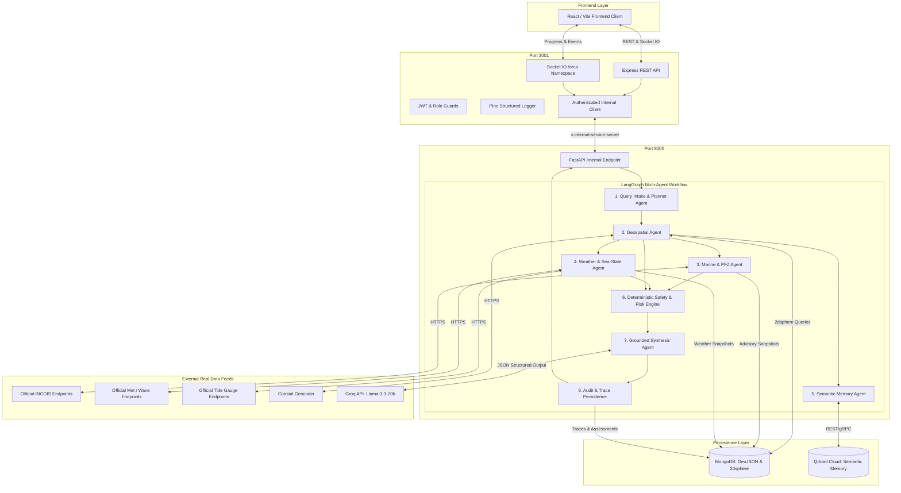
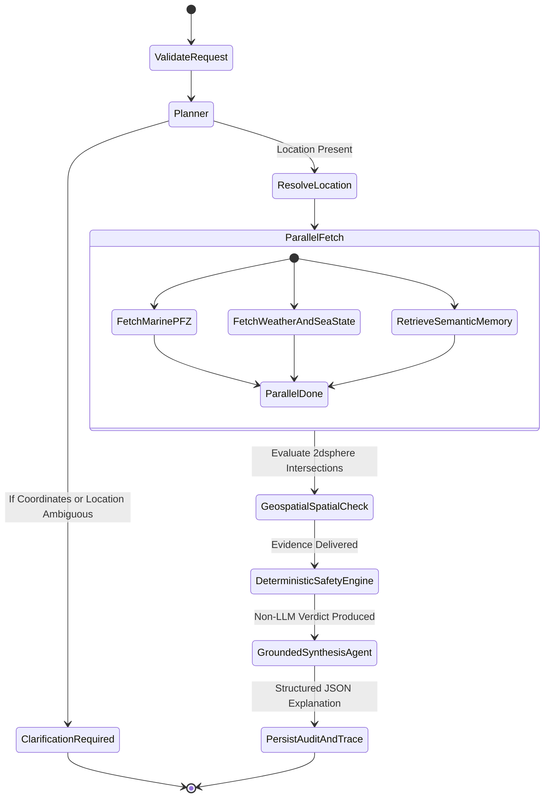

# ORCA System Architecture

> **Project Name:** ORCA (Marine Ecosystem Reasoning with Collaborative Agents)  
> **Problem Statement:** SIH26176  
> **Repository:** Backend Monorepo

---

## 1. High-Level Architecture Overview

ORCA implements a **dual-service, multi-agent cognitive architecture** specifically engineered for maritime safety, Potential Fishing Zone (PFZ) intelligence, and coastal disaster mitigation.

The platform decouples edge client communication (handled by a high-throughput **Node.js API Gateway & Realtime Service**) from intensive multi-agent reasoning (handled by a **Python FastAPI Agent Core** powered by LangGraph, Groq LLM, MongoDB GIS, and Qdrant Cloud).



---

## 2. Component Responsibilities

### 2.1 Node.js API Gateway (`apps/gateway`)
The Gateway is the public-facing application boundary:
- **Client Protocol Handling:** Exposes both REST (`/api/v1/orca/...`) and WebSocket (`/orca` namespace via Socket.IO).
- **Authentication & Authorization:** Issues and verifies cryptographically signed JWTs, hashes passwords using `bcryptjs`, and enforces role-based access control (`fisherman`, `authority`, `disaster_manager`, `admin`).
- **Security & Hardening:** Enforces `helmet` HTTP headers, strict CORS against configured origins, rate limiting via `express-rate-limit`, and payload size constraints (2MB maximum).
- **Correlation & Request Tracing:** Generates canonical `requestId` (UUIDv4) and `conversationId`, attaching them to structured Pino logs and forwarding them in HTTP headers (`x-request-id`).
- **Zero LLM Logic:** The Gateway contains **no machine learning or heuristic code**. It is strictly a performant, resilient gateway.

### 2.2 Python FastAPI Agent Core (`apps/agent-core`)
The Agent Core executes the cognitive LangGraph workflow:
- **Internal Only:** Never exposed publicly. Protected by the shared header `x-internal-service-secret`.
- **Typed Schemas:** Built on Pydantic v2 and `pydantic-settings` to guarantee strict JSON validation.
- **Asynchronous Execution:** Async I/O across Motor (MongoDB), httpx (external feeds), and Qdrant.
- **Zero Hallucination Invariant:** Unconfigured or failing external data sources return a structured `DATA_UNAVAILABLE` result. Telemetry values (wave height, wind speed, SST) are **never invented or inferred**.

---

## 3. The LangGraph Multi-Agent Workflow



### Node Details:
1. **Planner Agent (`planner.py`):**
   - Validates input format, determines user intent (`safety_check`, `find_pfz`, `route_safety`, `marine_status`, `authority_monitoring`).
   - If critical location information is absent, returns a structured clarification question immediately without executing external calls.
2. **Geospatial Agent (`geospatial.py`):**
   - Resolves coastal location names via the Geocoder adapter.
   - Enforces `[longitude, latitude]` coordinate ordering and bounds (`-180 <= lon <= 180`, `-90 <= lat <= 90`).
   - Executes MongoDB 2dsphere queries (`$nearSphere`, `$geoIntersects`) against designated restricted maritime zones and existing real PFZ features.
3. **Marine & PFZ Agent (`marine_pfz.py`):**
   - Interacts with configured real INCOIS endpoints.
   - Normalizes Potential Fishing Zone (PFZ) coordinates, sea surface temperature (SST), and chlorophyll density.
   - Persists raw snapshots in MongoDB.
4. **Weather & Sea-State Agent (`weather_sea_state.py`):**
   - Interacts with configured meteorological and oceanographic endpoints.
   - Normalizes physical units: **wind speed (m/s)**, **wave height (m)**, **precipitation (mm)**, **tide height (m)**.
   - Saves observation snapshots to MongoDB.
5. **Semantic Memory Agent (`semantic_memory.py`):**
   - Retrieves maritime standard operating procedures (SOPs), cyclone hazard manuals, and advisory guidelines from Qdrant Cloud.
   - Strictly marks reference knowledge as historical, preventing it from masquerading as real-time telemetry.
6. **Safety & Risk Engine (`safety/engine.py`):**
   - **100% Deterministic Python execution.** The LLM has zero authority over safety.
   - Evaluates vessel-specific limits from `policy.yaml` (wave thresholds, gale wind thresholds, restricted zone violations, and severe weather alert flags).
   - **Critical Rule:** Missing or stale telemetry produces `INSUFFICIENT_DATA` or `NO_GO`. It **never claims conditions are safe**.
7. **Synthesis & Explanation Agent (`synthesis.py`):**
   - Uses Groq LLM (low temperature `0.0`) to generate concise multilingual explanations.
   - Grounded strictly in the deterministic verdict and tool evidence ledger.
   - Validated against a strict Pydantic model (`GroundedSynthesisModel`).
8. **Audit & Trace Persistence (`repositories/audit_repository.py`):**
   - Writes request audit, trace milestones, and safety decisions into MongoDB collections (`queries`, `agent_traces`, `risk_assessments`).

---

## 4. Internal Security Model

All traffic between the Node Gateway and Python Agent Core is authenticated through a pre-shared secret:

```
[Node Gateway]
  │
  │  POST /internal/v1/orca/execute
  │  Header: x-internal-service-secret: <INTERNAL_SERVICE_SECRET>
  │  Header: x-request-id: <UUIDv4>
  ▼
[FastAPI Agent Core]
  │
  ├─ Verify header matches INTERNAL_SERVICE_SECRET
  └─ If mismatch -> 403 Forbidden
```

Secrets, passwords, authorization tokens, and API keys are redacted by both Pino (Node.js) and the custom JsonFormatter (Python) before any log output is generated.
