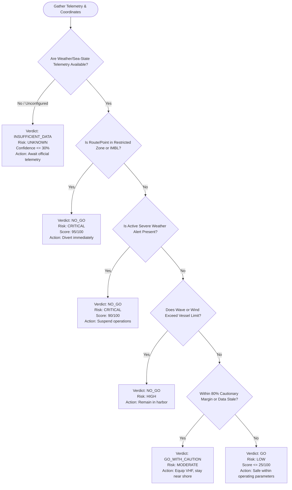

# ORCA Maritime Safety & Deterministic Risk Policy

> **Core Safety Principle:** Machine learning models (including Large Language Models) are non-deterministic and must **never** be the final arbiter of life-critical maritime safety decisions.
>
> In ORCA, all safety recommendations (`GO`, `GO_WITH_CAUTION`, `NO_GO`, `INSUFFICIENT_DATA`) are computed strictly by deterministic Python rules loaded from `apps/agent-core/app/safety/policy.yaml`.

---

## 1. Vessel Classification & Physical Operating Limits

Different fishing craft possess vastly different sea-keeping abilities. ORCA evaluates sea state strictly against the vessel class specified by the user or their registered profile:

| Vessel Class | Description | Max Wave Height ($H_s$) | Max Wind Speed | Cautionary Margin (80%) |
|---|---|---|---|---|
| `traditional_unmotorized` | Non-motorized country craft, kattumaram, dugout canoes | **1.2 meters** | **8.0 m/s** (~15.5 kts) | Wave > 0.96m or Wind > 6.4 m/s |
| `motorized_fiberglass` | Fiberglass reinforced plastic (FRP) boats with OBM/IBM (up to 32 ft) | **2.0 meters** | **12.5 m/s** (~24.3 kts) | Wave > 1.60m or Wind > 10.0 m/s |
| `mechanized_trawler` | Steel / wooden commercial trawlers and gillnetters (up to 70 ft) | **3.5 meters** | **18.0 m/s** (~35.0 kts / Gale) | Wave > 2.80m or Wind > 14.4 m/s |
| `deep_sea_vessel` | Tuna longliners, offshore oceanographic vessels | **5.0 meters** | **22.0 m/s** (~42.7 kts / Storm) | Wave > 4.00m or Wind > 17.6 m/s |

---

## 2. Policy Rule Evaluation Hierarchy

The rules are evaluated in strict priority order:

---

## 3. Critical Safety Invariants

### 3.1 Missing Critical Data Invariant
If real weather or sea-state telemetry is missing, unconfigured, or failing:
- **Verdict:** `INSUFFICIENT_DATA` (or `NO_GO` depending on coastal disaster readiness).
- **Prohibition:** The system **never** assumes absence of bad weather implies safe conditions. It **never** emits `GO` without live physical observations.

### 3.2 Severe Meteorological Alerts
Any official warning flag (e.g., Cyclonic Depression, Squall Alert, High Wave Alert issued by INCOIS/IMD) automatically triggers an immediate `NO_GO` recommendation and sets `risk_level: "CRITICAL"`.

### 3.3 Restricted Maritime Zones & International Maritime Boundary Line (IMBL)
Using MongoDB 2dsphere `$geoIntersects` queries, ORCA verifies whether the target destination or route trajectory crosses:
- International Maritime Boundary Line (IMBL) zones (e.g., Palk Strait / Gulf of Mannar).
- Designated Marine National Parks or protected biosphere reserves.
- Naval firing / exercise corridors.
Any intersection results in an immediate `NO_GO` verdict with explicit coordinates of the intersection.

### 3.4 Data Freshness Penalties
Telemetry older than `MAX_DATA_FRESHNESS_MINUTES` (default 360 minutes / 6 hours) is flagged as `stale`:
- Penalizes confidence score by -25 points.
- Prevents an unqualified `GO` recommendation; elevates verdict to `GO_WITH_CAUTION`.

---

## 4. Confidence Score Formula

Confidence ($C \in [0, 100]$) reflects coverage and recency:
$$C = \sum (\text{Provider Availability}) - \text{Staleness Penalty} - \text{Geospatial Uncertainty}$$

- If critical telemetry is unavailable: $C \le 30\%$.
- If live weather is fresh: $+50\%$.
- If INCOIS PFZ bulletin is verified: $+20\%$.
- If tide gauge data is verified: $+15\%$.
- If any active source is stale: $-25\%$.
